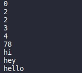

# Bubble-sort
This is the first project of Ruby, Advanced Building Blocks - Bubble Sort
# Bubble Sort Algorithms

> Implementation of bubble_sort and bubble sort by algorithms as outlined [here](https://github.com/TheOdinProject/curriculum/blob/master/ruby_programming/archive/basic_ruby/project_advanced_building_blocks.md#assignment-1) by the Odin Project.


A sorting algorithm that takes an array of elements as input, each element is then compared to the one next to it and they are swapped if the one on the left is larger than the one on the right. This continues until the array is eventually sorted.

## Built With

- Ruby

### Setup

To run this project locally, please ensure you have Ruby installed on your machine, then clone this repository by running.

```bash
git clone https://github.com/mricanho/Bubble-sort
```

After cloning open the file and write in terminal :

```bash 
 ruby main.rb
```
The code:


The result in terminal:



👤 **Miguel Ricaño*

- Github: [@mricanho](https://github.com/mricanho)
- Linkedin: [Miguel Ricaño](https://www.linkedin.com/in/mricanho/)

👤 **Ahmed Amin*

- Github: [@AhmedAmin90](https://github.com/AhmedAmin90)
- Twitter: [@AhmedAmin12383](https://twitter.com/AhmedAmin12383)
- LinkedIn: [in/web-developer](https://www.linkedin.com/in/web-developer)

## Show your support

Give a ⭐️ if you like this project!

## Acknowledgments

- Microverse
- The Odin Project

## 📝 License

This project is [MIT](LICENSE.md) licensed.
